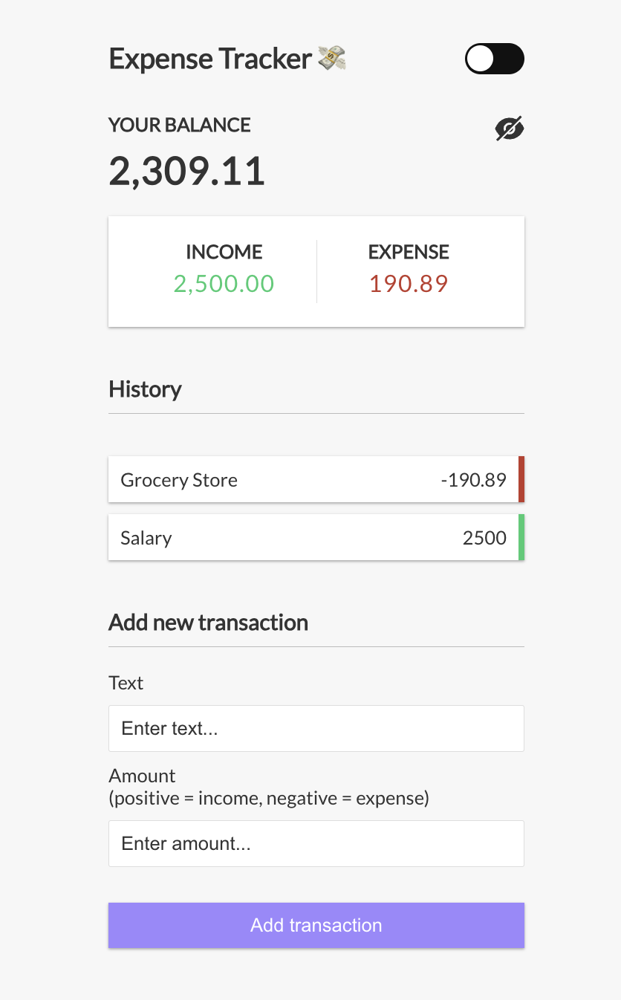
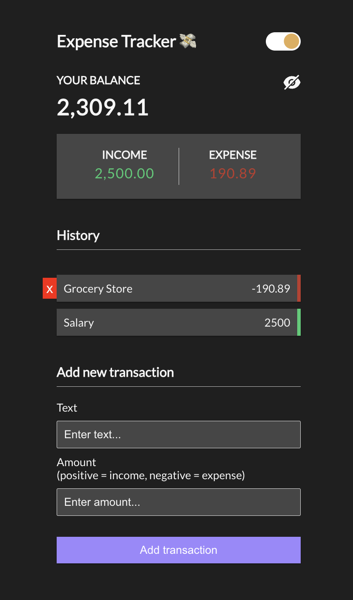

# Expense Tracker

This is a simple Expense Tracker application built with React. It allows users to keep track of their income and expenses, displaying the current balance, total income, and total expenses.

## Features

- **Balance Display**: Shows the current balance in the local format.
- **Income and Expense Display**: Shows total income and total expenses separately.
- **Transaction History**: Displays a history of all transactions (both income and expenses). Plus the possibility to delete them.
- **Add New Transaction**: Allows users to add new income or expense transactions.
- **Dark/Light Mode**
- **Hide/View expenses**

## Screenshots

